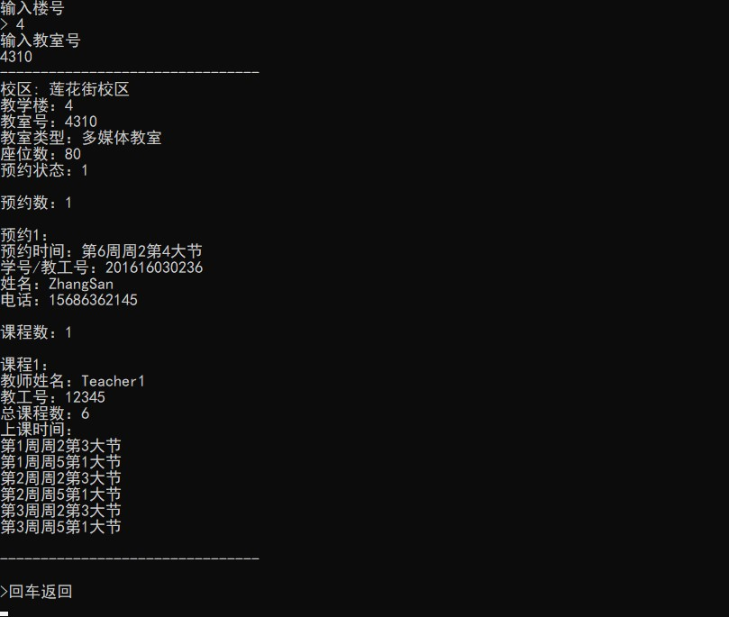
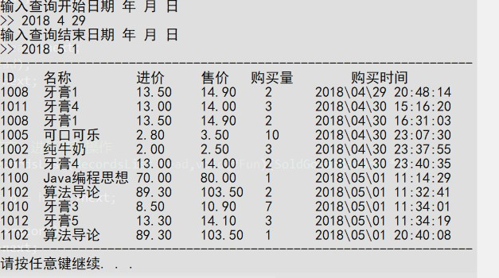
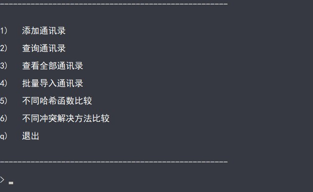

在此存放我在大学阶段所写的所有课程设计题目和代码

- OOP(C++)-面向对象程序设计：教室管理系统
- C-程序设计实践：小型超市库存与销售管理系统
- OS-操作系统课程设计：动态分区分配算法实现
- DataStructure-数据结构课程设计：基于哈希表的通讯录系统

----------

#### OOP(C++)-面向对象课程设计

##### 题目
实现一个简单的教室管理系统，系统基本功能包括
1) 教室信息维护：教室编号、类型、座位数等基本信息的维护；
2) 查询功能：查询满足指定条件的教室信息；
3) 预约功能：根据查询结果对指定教室进行预约操作；
4) 统计功能：统计各类教室的情况。

##### 完成时间
大二上 2018/2

#### 运行截图

----------

#### 程序设计实践课程设计（转专业补修）

##### 题目

用C语言开发一个小型超市库存与销售管理系统。

【系统实现功能】

1、用户管理（操作用户数据文件）。

- 高级用户（超市管理者）：具有所有功能，同时可以添加用户、删除用户。创建新用户后，将普通用户信息存储到文件“user.dat”中。

- 普通用户（售货员）：可执行销售业务处理和查询功能。

2、进货&库存业务管理（操作库存数据文件）。根据商品编号查找相应商品，如果不存在，执行添加操作 ；如果商品已存在，根据进货数量修改商品数量。

3、销售业务处理（操作库存数据文件和销售数据文件）。用户在销售数据文件中添加销售记录，同时更新库存数据文件的相应商品的信息。

4、查询功能。支持以下几种查询方式：

- 按商品名称（精确查找，或模糊查找）查询商品基本信息（商品名、售价、库存）

- 按商品名称和生产厂商（多条件查询）查询商品基本信息（商品名、售价、库存）；

- 按销售日期查询某一天销售的情况。

5、功能扩展。可以按照自己对商品库存与销售系统的理解和解决问题的程度对系统进行扩展。比如：

- 支持商品批量入库（从文件中导入）。

- 按照固定的日期范围统计所销售的货物信息（商品名称，销售总量，收益率），像，月销售情况统计，季度销售情况统计，年度销售情况统计。

- 按照销售量、销售利润等条件，统计指定日期范围内商品的销售情况。

##### 完成时间
大二下 2018/4

#### 运行截图

----------

#### 操作系统课程设计

##### 题目
用C语言实现动态分区分配过程alloc()和回收过程free()。其中，空闲分区通过空闲分区链表来管理，分别采用首次适应算法、循环首次适应算法、最佳适应算法、最坏适应算法进行内存块的分配和回收，同时显示内存块分配和回收后空闲内存分区链的情况。
##### 完成时间
大二下 2018/6/25至2018/6/29

#### 运行截图

----------

#### 数据结构课程设计（转专业补修）

##### 题目
综合应用所学知识，设计完成一个散列表实现的电话号码查找系统。本系统拟实现以下功能：

【基本要求】

1. 设每个记录有下列数据项：电话号码、用户名、地址；
2. 从键盘输入各记录，分别以电话号码和用户名为关键字建立散列表；
3. 采用一定的方法解决冲突；
4. 查找并显示给定电话号码的记录；
5. 查找并显示给定用户名的记录。

【进一步完成内容】

1. 系统功能的完善；
2. 设计不同的散列函数，比较冲突率；
3. 在散列函数确定的前提下，尝试各种不同类型处理冲突的方法，考察平均查找长度的变化。

##### 完成时间
大三上 2018/12/24至2019/1/4

#### 运行截图

----------
#### 软件体系结构课程设计

##### 系统功能
本程序为基于 C/S 的网络聊天室系统，使用 Linux 网络编程作为服务器，使用 QT
编程作为客户端。

客户端通过输入 IP 地址、端口号、Email、聊天名称、聊天组号连接到服务器，
用户通过客户端发送消息，同时接收来自相同组其他客户端发送的消息，获取当前在
线用户信息，通知新用户的上线和用户的下线，实现群聊功能。

服务器负责管理用户的连接、发送消息与退出，有新用户建立连接时，记录新用
户信息，并向同组其他客户端广播；用户退出时，清除用户信息，并向同组其他客户
端广播离开信息；当有用户发送消息时，向同组其他客户端广播。

#### 完成时间
大三下 2019/5至2019/6

#### 运行截图
